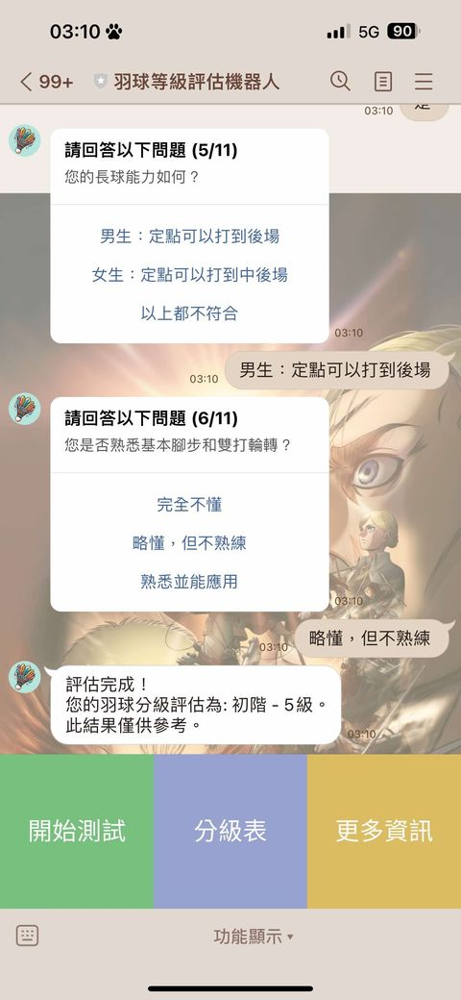
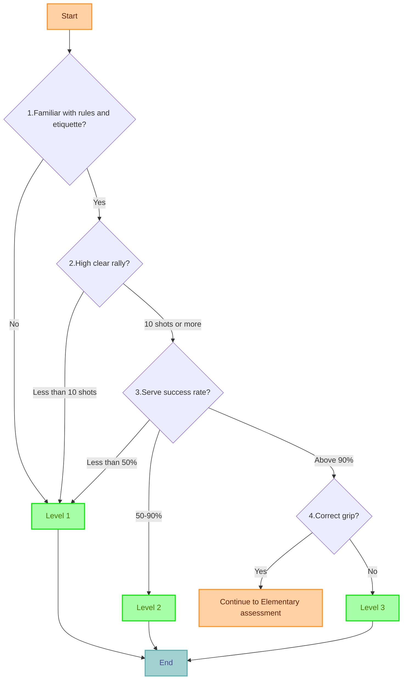
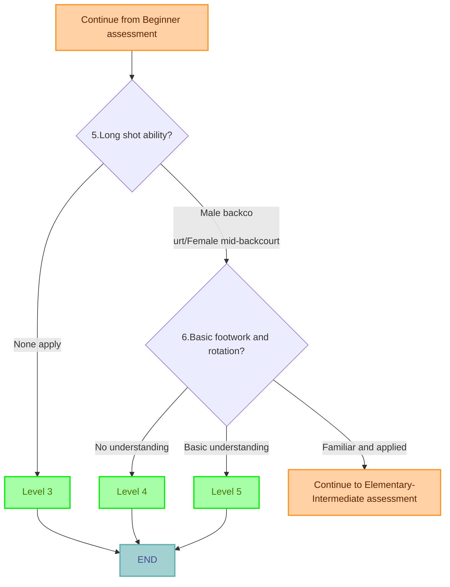
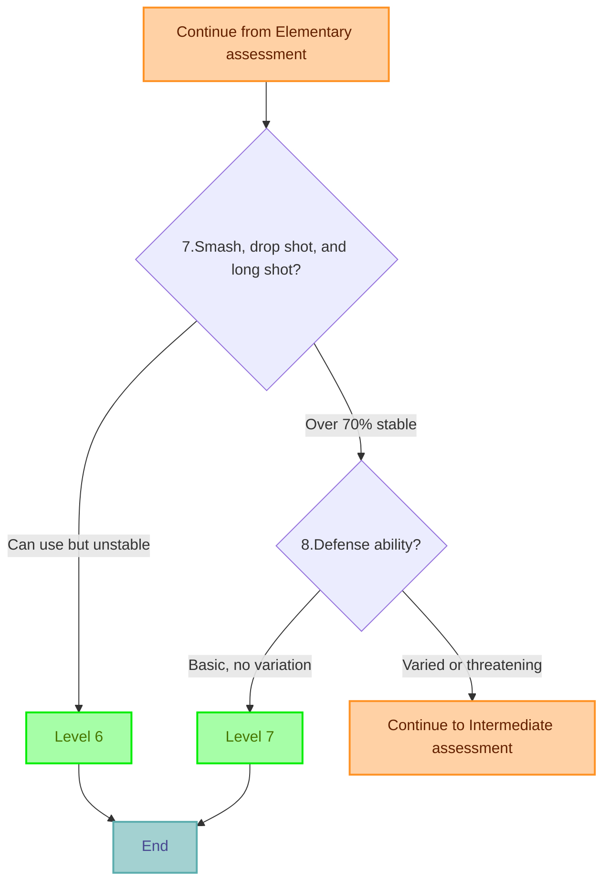
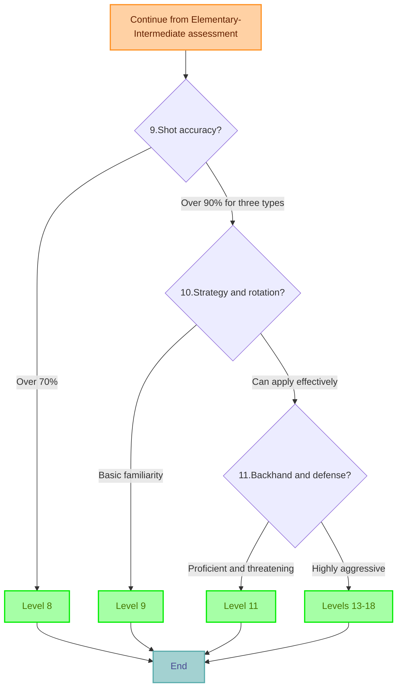

# badminton-level-evaluator-linebot

## Project Origin

One night, I suddenly had this idea and dove right in...

## How to Use

1. Add as a friend on Line: https://lin.ee/WSIa0i6
2. Select "Start Test" from the menu to begin the evaluation
3. Answer the questions as prompted
4. Receive your badminton skill level assessment result

## Questionnaire Design

This questionnaire is designed based on the classification system established by the Taiwan Badminton Promotion Association. The assessment process is as follows:

### Beginner Stage (Levels 1-3)

### Elementary Stage (Levels 4-5)

### Elementary-Intermediate Stage (Levels 6-7)

### Intermediate and Above (Levels 8-18)

## Tech Stack

- Backend: Python
- Framework: Flask
- Deployment: Heroku
- Interface: Line Bot

## References

- [Taiwan Badminton Promotion Association Classification System](https://www.facebook.com/2020TAIWANBADMINTON/photos/pb.100068630171046.-2207520000/324577532494995/?type=3)
- [Line Messaging API](https://developers.line.biz/en/docs/messaging-api/)
- [Python + Line bot: Building a Line bot from scratch and deploying to Heroku! | by Molly M | Medium](https://molly1024.medium.com/python-%E8%88%87-line-bot-%E5%BE%9E%E9%A0%AD%E9%96%8B%E5%A7%8B%E5%BB%BA%E7%AB%8B%E4%B8%80%E5%80%8B-line-%E6%A9%9F%E5%99%A8%E4%BA%BA-%E9%83%A8%E7%BD%B2%E5%88%B0-heroku-51512b04cb7b)

## Contributions

Pull requests and issue reports are welcome to help improve this project.

## License

This project is licensed under the MIT License. See the [LICENSE](LICENSE) file for details.