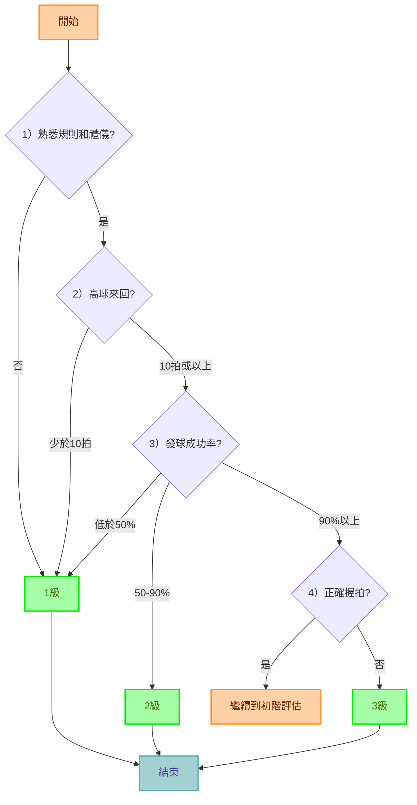
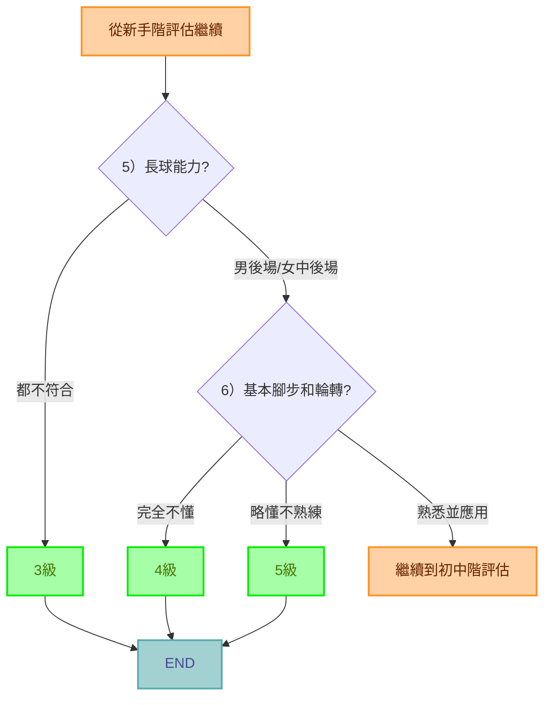
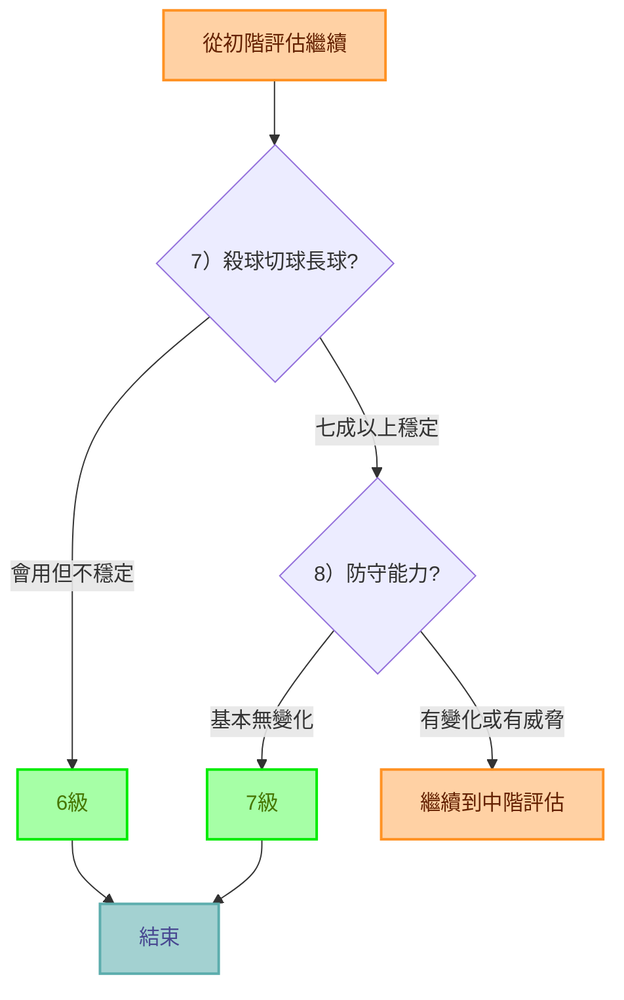
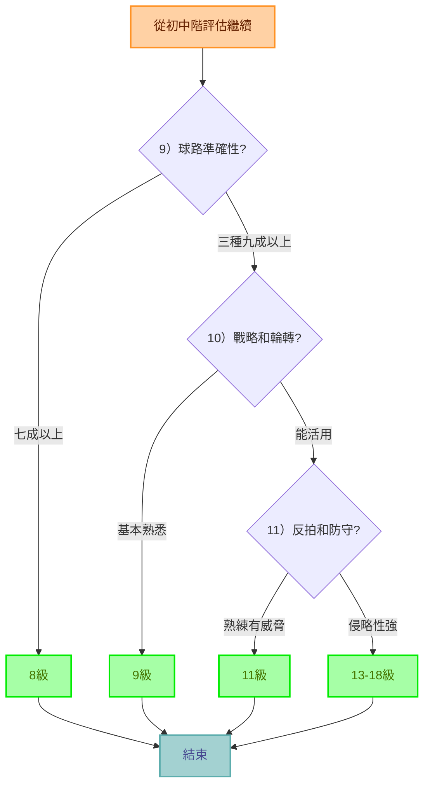

# badminton-level-evaluator-linebot

## 專案緣起

某個晚上突然想到就把頭洗下去了...

## 使用方法

1. 在 Line 上加入好友：https://lin.ee/WSIa0i6
2. 從選單點選 "開始測試" 來進行評估
3. 根據提示回答問題
4. 獲得您的羽球技能等級評估結果

## 問卷設計

本問卷依照台灣羽球推廣協會制定的分級制度表設計問卷，判斷流程如下

### 新手階 （1~3級）

### 初階 （4~5級）

### 初中階 （6~7級）

### 中階以上（8~18級）

## 技術棧

- 後端：Python
- 框架：Flask
- 部署：Heroku
- 介面：Line Bot

## 參考連結

- [台灣羽球推廣協會分級制度](https://www.facebook.com/2020TAIWANBADMINTON/photos/pb.100068630171046.-2207520000/324577532494995/?type=3)
- [Line Messaging API](https://developers.line.biz/en/docs/messaging-api/)
- [Python + Line bot 從頭開始建立一個 Line 機器人，部署到 Heroku！ | by Molly M | Medium](https://molly1024.medium.com/python-%E8%88%87-line-bot-%E5%BE%9E%E9%A0%AD%E9%96%8B%E5%A7%8B%E5%BB%BA%E7%AB%8B%E4%B8%80%E5%80%8B-line-%E6%A9%9F%E5%99%A8%E4%BA%BA-%E9%83%A8%E7%BD%B2%E5%88%B0-heroku-51512b04cb7b)

## 貢獻

歡迎提交 Pull Requests 或開 Issues 來幫助改進這個專案。

## 授權

本專案採用 MIT 授權。詳見 [LICENSE](LICENSE) 文件。